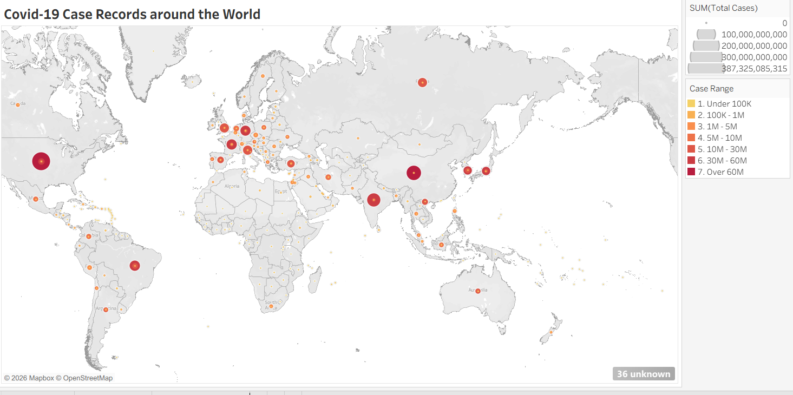
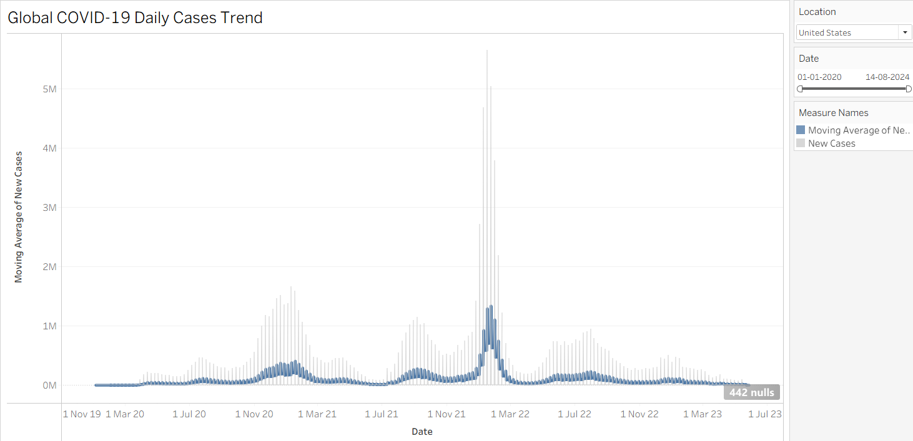
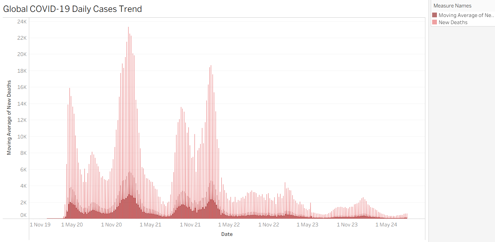
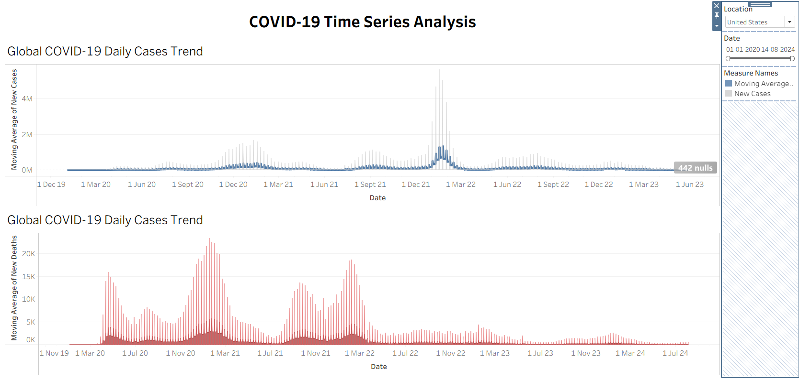

# COVID-19 Tableau Dashboard

> Interactive data visualization analyzing global COVID-19 trends with geographic heatmaps and time-series analysis

---

## Dashboard Overview

This Tableau dashboard visualizes 400,000+ COVID-19 records across 248 countries, providing interactive insights into infection patterns, mortality trends, and geographic distribution.

**Data Source**: `COVID19_Tableau_Data.csv` (generated from Jupyter notebook)

---

## Dashboard Components

### 1. Geographic Heatmap



**Features:**
- Color-coded countries by total cases (light yellow → dark red)
- Interactive tooltips showing country-specific statistics
- 63 countries with precise geographic coordinates
- Filterable by date range and continent

**How to Create:**
1. Connect to `COVID19_Tableau_Data.csv`
2. Drag `Longitude (generated)` → Columns
3. Drag `Latitude (generated)` → Rows
4. Drag `Location` → Detail
5. Drag `SUM(Total Cases)` → Color
6. Edit Colors → Red-Gold palette, Stepped (7 steps), Reversed

**Insights Visible:**
- USA, India, Brazil show highest case counts (dark red)
- Island nations (New Zealand, Australia) show lower rates (light yellow)
- European cluster shows moderate-high levels (orange-red)

---

### 2. Daily Cases Trend



**Features:**
- Raw daily new cases (gray area/line)
- 7-day moving average (dark blue line)
- Smooths weekend reporting effects
- Shows pandemic wave patterns clearly

**How to Create:**
1. Drag `Date` → Columns (continuous, exact date)
2. Drag `New Cases` → Rows
3. Right-click `SUM(New Cases)` → Quick Table Calculation → Moving Average
4. Edit Table Calculation → Period: 7 days
5. Duplicate pill (Ctrl+drag) for raw data
6. Remove calculation from second pill
7. Dual Axis → Synchronize Axis
8. Format: Blue (MA), Gray 50% opacity (raw)

**Insights Visible:**
- First wave: March-April 2020 (initial spike)
- Second wave: Winter 2020-2021 (pre-vaccine)
- Delta wave: Mid-2021 (moderate spike)
- Omicron wave: Late 2021-Early 2022 (highest peak)
- Endemic phase: 2022+ (lower, stable levels)

---

### 3. Daily Deaths Trend



**Features:**
- Raw daily new deaths (light red area)
- 7-day moving average (dark red line)
- Follows case patterns with ~2-3 week lag
- Shows vaccination impact (deaths decline while cases remain high)

**How to Create:**
1. Same process as Daily Cases
2. Use `New Deaths` instead of `New Cases`
3. Format: Red colors instead of blue
4. 7-day moving average smooths reporting delays

**Insights Visible:**
- Death peaks lag case peaks by 2-3 weeks
- Later waves show lower death-to-case ratio (better treatment, vaccines)
- Omicron wave: Highest cases but proportionally fewer deaths
- Demonstrates vaccine effectiveness in preventing severe outcomes

---

### 4. Time Series Analysis (Combined View)



**Features:**
- Both cases and deaths trends on one dashboard
- Synchronized date filters
- Country selection dropdown
- Side-by-side comparison of metrics

**Layout Structure:**
```
┌─────────────────────────────────────────────┐
│     COVID-19 Time Series Analysis           │
├──────────────────────────────┬──────────────┤
│                               │   FILTERS:   │
│   Daily Cases Trend           │   Date Range │
│   (with 7-day MA)            │   Country    │
│                               │              │
├──────────────────────────────┤              │
│                               │              │
│   Daily Deaths Trend          │              │
│   (with 7-day MA)            │              │
│                               │              │
└──────────────────────────────┴──────────────┘
```

**How to Create:**
1. Create new Dashboard
2. Drag "Daily Cases Trend" worksheet → Top
3. Drag "Daily Deaths Trend" worksheet → Bottom
4. Show filters on right side
5. Apply filters to both worksheets

**Interactive Features:**
- Date slider: Adjust time range dynamically
- Country filter: Focus on specific nations
- Cross-filtering: Click on map to filter charts

---

## Design Specifications

### Color Palette

| Metric | Color | Hex Code | Usage |
|--------|-------|----------|-------|
| **Cases** | Blue | #084594 | Moving average line |
| **Cases (raw)** | Gray | #CCCCCC | Background area/line |
| **Deaths** | Dark Red | #7F0000 | Moving average line |
| **Deaths (raw)** | Light Red | #FFC0CB | Background area/line |
| **Heatmap (low)** | Light Yellow | #FFF7BC | Countries with few cases |
| **Heatmap (high)** | Dark Red | #8C2D04 | Countries with many cases |

### Typography

- **Dashboard Titles**: Tableau Bold, 18-20pt
- **Chart Titles**: Tableau Bold, 14-16pt
- **Axis Labels**: Tableau Book, 11pt
- **Tooltips**: Tableau Book, 10pt

### Formatting Standards

**Y-Axis:**
- Cases: `#,##0,,"M"` (millions format)
- Deaths: `#,##0,"K"` (thousands format)

**Date Axis:**
- Show month/year labels
- Quarterly gridlines
- Continuous (not discrete) for smooth trends

**Tooltips:**
```
Country: <Location>
Date: <Date>
Total Cases: <SUM(Total Cases)>
New Cases: <SUM(New Cases)>
7-Day Average: <7-Day MA>
```

---

## Technical Implementation

### Data Connection
```
1. Open Tableau Desktop
2. Connect to Data → Text File
3. Select: COVID19_Tableau_Data.csv
4. Click "Sheet 1" to start
```

### Geographic Role Assignments
```
Right-click on fields → Geographic Role:
├─ Location → Country/Region
├─ Latitude → Latitude
├─ Longitude → Longitude
└─ Iso_Code → Country/Region (ISO 3166-1 alpha-3)
```

### Calculated Fields

**7-Day Moving Average (Cases):**
```
WINDOW_AVG(SUM([New Cases]), -6, 0)
```

**7-Day Moving Average (Deaths):**
```
WINDOW_AVG(SUM([New Deaths]), -6, 0)
```

### Filter Configuration

**Date Range Filter:**
```
Type: Range of Dates
Show: Slider
Apply to: All worksheets using this data source
```

**Country Filter:**
```
Type: Multiple Values (dropdown)
Show: Single Value (list) or Multiple Values (list)
Apply to: All worksheets using this data source
```

---

## Dashboard Interactions

### User Capabilities

**Geographic Heatmap:**
- Hover over countries → See tooltip with stats
- Click country → Filter other visualizations
- Zoom/pan to focus on specific regions

**Time Series Charts:**
- Adjust date slider → Update all visualizations
- Select country filter → Focus on specific nation
- Hover over lines → See exact values
- Compare multiple countries side-by-side

**Cross-Filtering:**
- Click on map → Time series updates for that country
- Select date range → Map colors update to that period
- Choose country → All charts show only that country

---

## Key Insights from Dashboard

### Geographic Patterns
1. **Highest Total Cases**: USA (103M+), China (99M+), India (45M+)
2. **Highest Per Capita**: Small European nations, Gulf states
3. **Lowest Impact**: Pacific island nations, some African countries

### Temporal Patterns
1. **Wave 1 (Mar-Apr 2020)**: Initial outbreak, highest fatality rate
2. **Wave 2 (Winter 2020-21)**: Pre-vaccine, sustained high levels
3. **Wave 3 (Summer 2021)**: Delta variant, breakthrough infections
4. **Wave 4 (Winter 2021-22)**: Omicron, highest cases but lower deaths
5. **Endemic Phase (2022+)**: Stable baseline, periodic fluctuations

### Correlation Analysis
- **Population Density**: Moderate correlation with case rate
- **GDP per Capita**: Negative correlation with CFR (better healthcare)
- **Median Age**: Positive correlation with CFR (older = more vulnerable)
- **Vaccination Rate**: Strong negative correlation with deaths in later waves

---

## Author
**Manasa Vijayendra Gokak**  
Graduate Student – Data Science  
